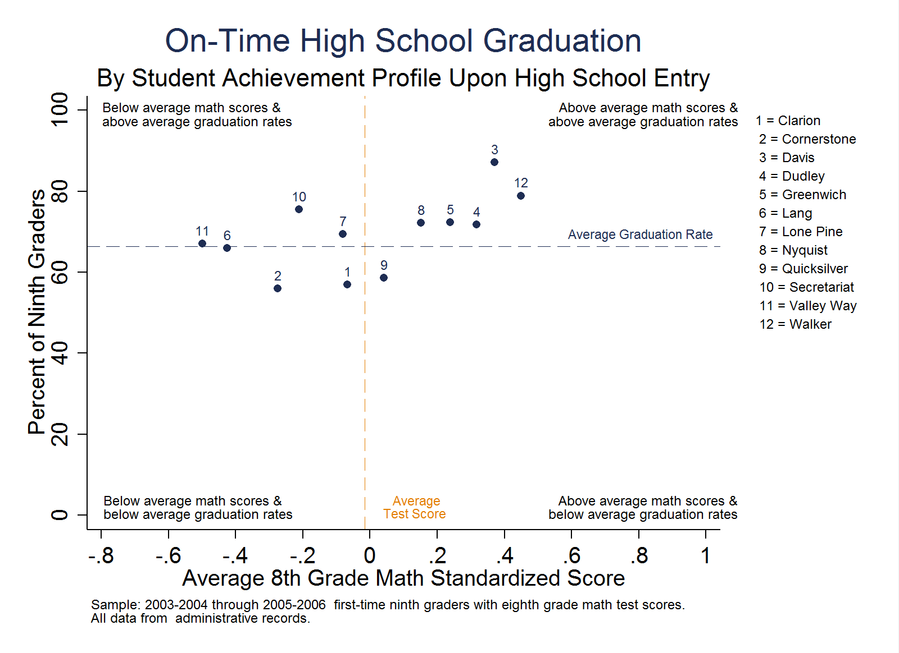

<!DOCTYPE html>
<html lang="en">
<head>
<meta charset="utf-8">
<meta http-equiv="X-UA-Compatible" content="IE=edge">
<meta name="viewport" content="width=device-width, initial-scale=1">
<meta name="format-detection" content="telephone=no">
<title>Stata Webdoc Template</title>
<meta name="author" content="OpenSDP">
<link href="https://maxcdn.bootstrapcdn.com/bootswatch/3.3.7/journal/bootstrap.min.css" rel="stylesheet" integrity="sha384-1L94saFXWAvEw88RkpRz8r28eQMvt7kG9ux3DdCqya/P3CfLNtgqzMnyaUa49Pl2" crossorigin="anonymous">

<link type="text/css" rel="stylesheet" href="styles/jquery.tocify.css" />

</head>
<body>

# Adding Text

## Regular Text
To create text for your web document, start a multi-line comment block using `/***` and end with `***/`.

## Headers and Table of Contents

Add headers to your web document by putting hash symbols before text inside comment blocks, e.g. `# Header 1`. 
The more hash symbols, the deeper the level in the table of contents and the smaller the header font size will be. All headers
will be added to the table of contents automatically

# Adding Code

You can indicate code in a different font within the text by using double tick marks, e.g. `` `some code here` ``. 
Code blocks run by Stata are added by putting regular lines of code in your .do file outside of 
the comment blocks. For more advanced options for adding and suppressing code, 
see the webdoc help file.

# Generate Data or Use Your Own

Take advantage of the `OpenSDPsynthR` synthetic data by downloading a college-going
analysis file. Use the Stata `webuse` command to load the file. 

You can also generate a synthetic dataset based on your own data using the `synthpop` package in R.

# Adding Graphs

You can use `webdoc graph` to add graphs to your webdoc. The example below 
is from OpenSDP's [College-Going Pathways](https://github.com/opensdp/college-going-stata) web guide series.  
<figure id="fig-hs_grad_prior_ach">

</figure>

# Ideas for Starting Your Analysis

You should feel free to create and annotate your project as you see fit. However,
if you have trouble getting started here's an example outline for describing your project.
We suggest providing some text with code about how you pulled your data together.
Then, unlock the power of webdocs by providing additional text on the context and reasoning
behind your analyses.

## Clean the Data

In this section, describe the process you use to clean the data, organize the variables, 
and apply business rules for data consistency.

## Connect the Data

In this section, describe how you combine data from different levels of aggregation 
and compute calculated variables to create a data set (or data sets) suitable for analysis.

## Analyze the Data

In this section, describe your analyses and show the code you used to complete each analysis. 
Include diagnostic plots, summary tables, and model output.

## Report the Results

In this section, make your final results available. Include explanatory graphics that you 
would use in a presentation. Include ways of demonstrating the substantive impact of your 
results.

 
 

</body>
</html>
